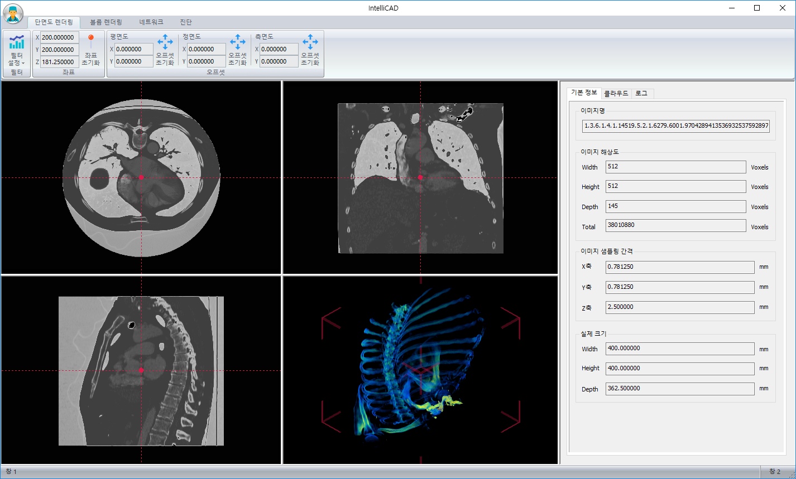

# IntelliCAD
Hansung University Capstone Design Project

- 작품 개요 

  현대의 의료 분야에는 몇가지 문제점이 대두되고 있습니다. 
  그 중 하나는 영상의학 전문의가 부족하다는 것입니다. 
  영상의가 부족할수록 환자에게 진단을 내리는 시간은 지연됩니다. 
  두번째로, 영상의에 의한 판독 부정확성이 높습니다. 
  대개 응급실의 경우, 짧은 시간 내 빠른 판독을 요구하는데 이러한 제한 사항으로 인해 영상의들은 예비 판독만으로 환자 대응을 하게 됩니다.
  결국 이는 잦은 사고로 이어지게 됩니다. 
  저희는 이러한 문제점들을 개선하기 위한 방안을 모색하였고, 이에 본 프로젝트를 기획하게 되었습니다. 
  
  **IntelliCAD**는 "지능적인"을 뜻하는 Intelligent와 컴퓨터 보조 진단 및 검출 프로그램의 약자인 CAD를 합친 합성어 입니다.
  **기계 학습 알고리즘을 활용한 컴퓨터 보조 진단 프로그램**이며, 프로그램 사용 만으로 높은 정확률의 의료 영상에 대한 분석 소견을 얻을 수 있습니다.

- 명세 

- 사용 방법 

- 개발 환경 및 타겟 플랫폼 

  - 타겟 플랫폼: Windows OS
  - 타겟 머신: 64bits 지원 CPU 및 Compute Capability 6.1 이상의 Nvidia GPU
  - 개발 도구: Microsoft Visual Studio 2019
  - 개발 언어: C/C++, CUDA C

- 프로젝트 구조 

- demo  

