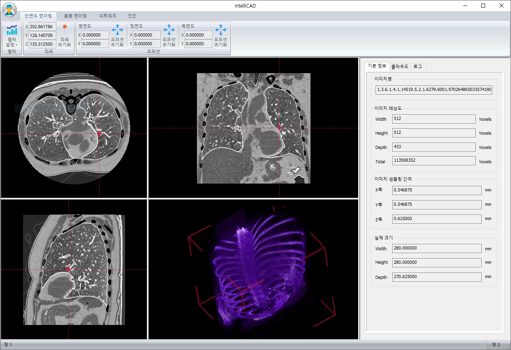
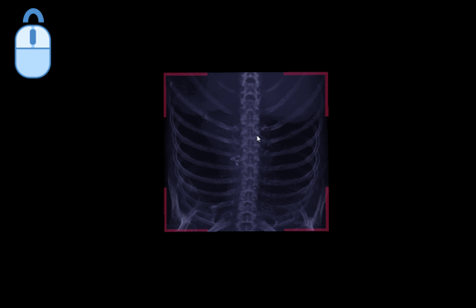
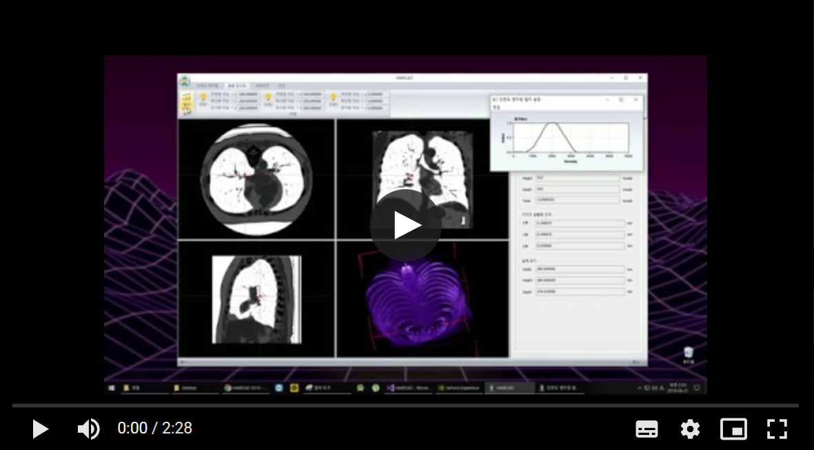

 This work is licensed under a <a rel="license" href="http://creativecommons.org/licenses/by-nc-nd/4.0/">Creative Commons Attribution-NonCommercial-NoDerivatives 4.0 International License</a>.

# IntelliCAD

오늘날 국내 영상의학 전문의의 부족으로 인하여, 의료 영상(X-ray, CT, MRI)을 촬영한 직후 판독까지 걸리는 시간이 증가하고 있습니다.
이는 치료의 지연으로 이어지며, 피해는 환자들의 몫이 됩니다.

IntelliCAD는 시각화에 특화된 CAD(Computer-Aided Detection and Diagnosis) 프로그램입니다.  
영상의학 전문의 및 관련업 종사자의 업무 보조 용도로 개발되었습니다.

대표적인 기능들은 다음과 같습니다.

<table>
  <tr><td></td></tr>
  <tr><td>
    입력받은 의료 영상을 3차원으로 재구성하여 실시간으로 렌더링합니다. 
    평면도, 측면도, 정면도를 제공합니다. 
    평, 측, 정면도 상에서 사용자가 특정 위치를 클릭하면, 나머지 화면에서도 해당 위치를 표시해줍니다.
  </td></tr>
</table>

<table>
  <tr><td></td></tr>
  <tr><td>
    분할 화면을 더블 클릭하면 해당 화면이 확대됩니다.  
    3차원 렌더링 화면에서 사용자는 입력 이미지의 크기를 붉은색 가이드라인으로 확인할 수 있습니다. 
    IntelliCAD는 밀도 기반 필터링 기능을 제공합니다. 
    따라서 특정 조직 군만 분리하여 시각화할 수 있습니다.
  </td></tr>
</table>

<table>
  <tr>
    <td></td>
    <td></td>
    <td></td>
  </tr>
  <tr>
    <td>단면도 오프셋 이동</td>
    <td>단면도 확대/축소</td>
    <td>단면도 필터 설정</td>
  </tr>
  <tr>
    <td></td>
    <td></td>
    <td></td>
  </tr>
  <tr>
    <td>평면도 깊이 이동</td>
    <td>정면도 깊이 이동</td>
    <td>측면도 깊이 이동</td>
  </tr>
</table>

<table>
  <tr>
    <td></td>
    <td></td>
    <td></td>
  </tr>
  <tr>
    <td>볼륨 시점 이동</td>
    <td>볼륨 확대/축소</td>
    <td>볼륨 필터 설정</td>
  </tr>  
  <tr>
    <td></td>
    <td></td>
    <td></td>
  </tr> 
  <tr>
    <td>볼륨 Pitch 회전</td>
    <td>볼륨 Yaw 회전</td>
    <td>볼륨 Roll 회전</td>
  </tr>  
</table>

다양한 렌더링 기능을 제공하기 위하여, GPU를 최대한 활용하고 싶었습니다. 
그러나 저희가 바라는 기능을 적절히 처리해줄 수 있는 상용 렌더링 프레임워크는 존재하지 않았습니다. 
다음의 기능들이 필요했습니다.

- MFC GDI+ 캔버스 버퍼를 GPU 렌더 타겟으로 설정하여, host-device간 렌더링 협업을 하고자 하였습니다. 
  GPU 상에서 그려낸 이미지 위에 점선을 그리거나 동그라미, 삼각형 등을 표시하고 싶었기 때문입니다.
- 볼륨 기반의 객체를 사용자 파라미터 기반으로 시각화 하고 싶었습니다.

결국 여러가지 프레임워크의 기능을 조합하기로 결정했습니다.

먼저 단일 버퍼를 GDI+와 GPU가 공유할 수 있도록 하기 위해 wglew를 활용하였습니다. 
device context(host 인터페이스)를 생성하고 이를 기반으로 rendering context(device 인터페이스)를 생성한 뒤, 
context의 제어권 소유를 적절히 동기화 하여 협업이 가능하도록 하였습니다.

OpenGL, Direct3D, Vulkan 등의 렌더링 프레임워크들은 메시 기반의 객체를 시각화하기 위해 만들어진 폴리곤 렌더링 엔진이기 때문에, 
의료 영상의 시각화에는 적절하지 않습니다. 
shear-warp[1] 기법을 사용할 경우 텍스처링 기능을 통해 시각화 하는 기법이 있긴 하지만, 
shear-warp은 품질 이슈를 포함한 몇 가지 한계점이 존재하기 때문에 채택하지 않았습니다.

저희는 CUDA를 사용하여 ray-casting 기반 볼륨 렌더링[2] 엔진을 직접 구현하였습니다. 
이 때 host-device간 메모리 병목 현상을 완화하기 위해, 
렌더링 엔진이 wglew와 협업하여 frame buffer를 직접 기록할 수 있는 권한을 갖도록 하였습니다. 
전체 렌더링 메커니즘을 정리해보자면 아래와 같습니다.

 

다음은 렌더링 엔진 커널을 이용하여 다양한 볼륨 기반 영상을 시각화한 것입니다.
<table>
  <tr><td>
    &nbsp;&nbsp;
  </td></tr>
  <tr><td>
    그림 3 
    좌측부터 머리, 흉부, 복부입니다. 셰이딩 및 필터링 조건을 다양하게 부여하였습니다.
  </td></tr>
</table>

프로젝트 구조는 크게 UI 레이어, System 레이어, Worker 레이어로 나뉩니다. UI 레이어에서는 GUI 환경을 통해 사용자와 상호작용을 수행하게 됩니다. System 레이어에는 이벤트 브로드캐스터와 비동기 작업관리자가 있으며, 이벤트와 실제 로직 수행을 분리하는 역할을 담당합니다. 이벤트 브로드캐스터는 이벤트의 종류에 따라 실제 작업을 수행할 워커 모듈 및 파라미터를 parsing하여 비동기 작업관리자에게 넘겨줍니다. 이후 비동기 작업관리자는 이 정보를 기반으로 새로운 스레드와 작업을 생성하여 워커 모듈에게 작업 수행을 지시합니다. 워커 모듈이 작업을 완료하게 되면 비동기 작업 관리자에게 반환 값과 함께 작업이 완료되었음을 보고하고, 이러한 보고는 “완료된 작업” 큐에 쌓여 보관됩니다. 마지막으로 메인 루프에서 주기적으로 완료된 작업 큐에서 작업들을 꺼내 이벤트 브로드캐스터로 보고합니다.

프로젝트 메커니즘은 다음과 같습니다.

<kbd></kbd>

아래는 데모 영상입니다.

> 레퍼런스 
[1]	Lacroute, Philippe, and Marc Levoy.  
&nbsp;&nbsp;&nbsp;&nbsp;"Fast volume rendering using a shear-warp factorization of the viewing transformation." 
&nbsp;&nbsp;&nbsp;&nbsp;&nbsp;Proceedings of the 21st annual conference on Computer graphics and interactive techniques. ACM, 1994. 
[2]	Levoy, Marc. "Display of surfaces from volume data." IEEE Computer graphics and Applications 8.3 (1988): 29-37.
